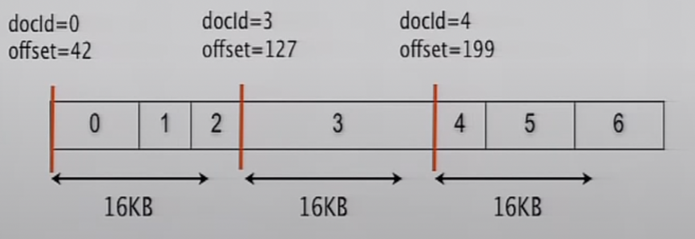
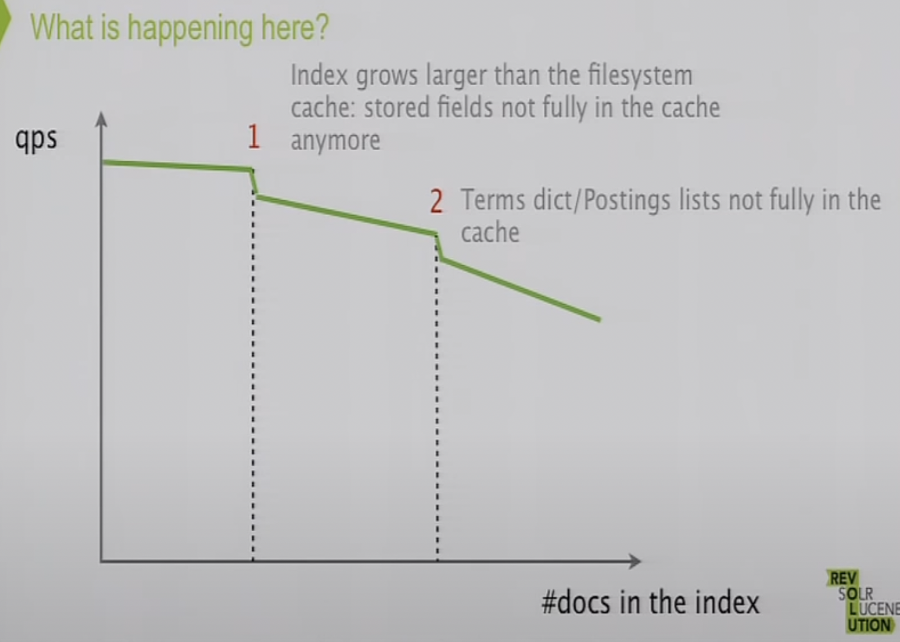

In case of insertions of documents -> new segments are created.  
When there are too many segments -> merge them.  

Ordinals are the internal lucene document ID -> should not be used in application logic.  

Each segment contains multiple inverted-index (one for each field in the document).  

The inverted index contains the mapping from terms to documents, the documents mapping is called posting list which is a sorted skip list (helps in index intersection -> query can use multiple indexes).  

Segments are immutable in lucene -> so searches are lock-free and the segments are also filesystem-cache-friendly.  

Lucene contains a data structure to store a bit for each document -> 1:alive, 0:deleted.  

Terms in lucene are identified by unique ordinal number(of type long) for each term -> comparing longs better than comparing strings.

Term vectors -> per-document inverted index -> used in more-like-this type of queries and highlighting  search results.  

Norms -> for each field of each document store a numeric doc value -> the value is associated with the length of the content value(or some user given index-time boost factor) and used for scoring.  

Sorted Set Doc values -> for each document per field store ordinals of the terms that are associated with the document's field -> and for each field there is a term dictionary which maps ordinal to value and some data like its frequency, its offset in posting list -> used for faceting.  

Stored Fields -> use to get many fields for few docs  
Stored as:  
0,A|0,B|0,C|1,A|1,B|1,C|2,A|2,B|2,C|  
(numbers are docs and letters are fields)

Doc Values -> use to get few field values for many docs  
Stored as:  
0,A|1,A|2,A|  
0,B|1,B|2,B|  
0,C|1,C|2,C|  

**Compression Techniques used:**  
- Bit packing/ vInt encoding -> used for postings lists and numeric doc values.  
- LZ4 -> used for stored fields and term vectors.  
- FSTs -> used for in-memory compression, it is basically a Map of String to any type, the keys share prefixes and suffixes, used in terms index -> store only the prefixes of the terms in the FST structure.

**Process to do a Term Query:**

1. Terms index -> this is in-memory FST storing terms prefixes -> traversing it like a trie gives the offset of the prefix in the terms dictionary.

2. Terms Dictionary -> go at the offset we get from terms index -> contains all terms with the prefix we get in terms index -> search sequentially for the exact term -> the dictionary provides the offset of the exact term in posting list.  

3. Postings List -> contains the doc id which contains the term we are suching for.  
This is encoded using modified FOR(fram of reference) delta  
ex: we have list -> 1,3,4,6,8,20,22,26,30,31 (requires 10 * 4 = 40 bytes)  
    - delta-encode:    
    encoded as: 1,2,1,2,2,12,2,4,4,1
    - split into block of N values (in general in lucene N = 128, for example using N=4)  
    splitted posting list: (1,2,1,2) (2,12,2,4) 4,1  
    - bit packing per block  
    The first block require 2 bits per value(total 1 byte), the second block require 4 bits per value(total 2 byte)  
    - if remaining docs, encode with vInt  
    Here the two docIds left, 4,1 are not part of any block -> these are encoded using vInt technique (vInt encoding requires only 1 byte per value)   
The encoded list requires a total of 5 bytes.

4. Stored Fields -> after getting docIds from posting list, we get required fields of the docs  
    - In-memory index for subset of doc ids -> tells offset of some docs in the files -> monotonic order of doc ids and hence can be searched using binary search
    - The stored fields are accessed using the offset -> these are compressed using LZ4  
When documents are inserted the are initially stored in in-meory buffer, when it grows beyond 16KB -> the chunks are stored in files after compression using LZ4 in 16+ KB blocks.
  
Observe that for at max each compressed 16KB data -> the in-memory index entry is of 16 bytes(8 for docId, 8 for offset) -> 1000 times smaller.  

So any term query we do -> 2 disk seeks per field for search(1 for term dictionary, 1 for postings list, but most of time they are stored in file-system-cache) and 1 disk seek for doc for stored fields.

**Pulse** optimization -> if for a term -> its frequency of occurence is 1(eg: single word primary key) -> then the term dictionary directly contains the doc id instead of offset in posting list -> so only 1 disk seek for search part and then 1 for doc for stored fields.  

**Note:**

  

Reference : [https://www.youtube.com/watch?v=T5RmMNDR5XI](https://www.youtube.com/watch?v=T5RmMNDR5XI)

